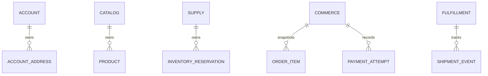

# Database architecture

FresVeg uses one PostgreSQL database with isolated schemas. The schema boundary is the service ownership boundary.

Each service has a runtime role and a separate migrator role. Bootstrap creates schemas and roles through the root Liquibase changelog. Services then run only their own `service` context migrations and keep Liquibase history in their owned schema. Runtime users do not own schemas and cannot modify Liquibase metadata.
