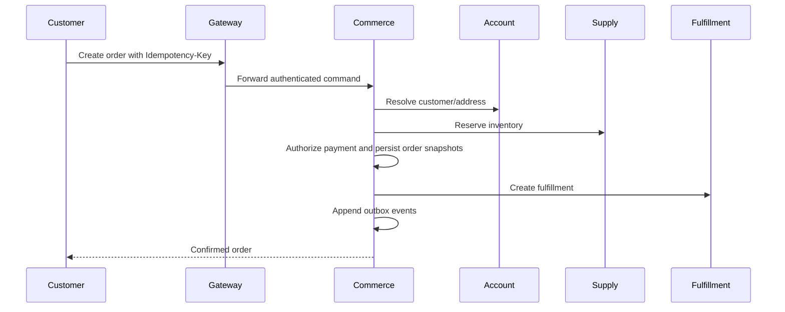

# Integration architecture

Commerce coordinates checkout through synchronous calls and durable local state. Supply owns inventory reservation correctness. Fulfillment owns delivery capacity and tracking after an order is confirmed. Outbox events provide an asynchronous extension point for downstream consumers.
