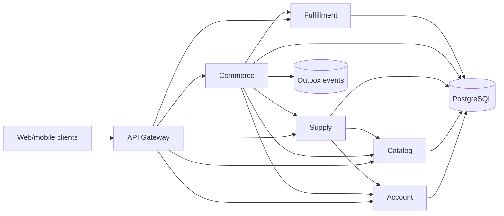

# Solution architecture

FresVeg uses a service-per-domain architecture with an API gateway at the public edge. Each domain service owns its database schema, migrations and HTTP contract. Cross-service state is referenced by UUID and snapshots are stored where business history must remain immutable.

Synchronous APIs serve user and service commands. Commerce owns checkout consistency and uses durable idempotency records, order snapshots, payment attempts and outbox rows to survive retries and ambiguous downstream results.
