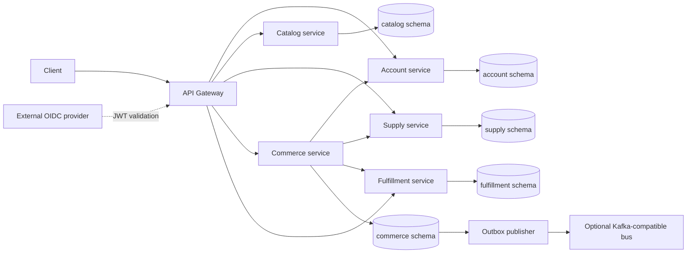

# Target state

Planning baseline from the [master implementation](../codex/FRESVEG_MASTER_IMPLEMENTATION.md); nothing in this document is implemented in Phase 0.

## Structure and execution

Use the existing workspace root as `fresveg-platform`, with a Maven parent and seven modules: `platform-common`, `api-gateway`, `account-service`, `catalog-service`, `supply-service`, `commerce-service`, and `fulfillment-service`. The gateway and five domain services are independently deployable; common is a library. Add `contracts/openapi`, `contracts/asyncapi`, service-owned `database` directories, `infrastructure/docker`, and `infrastructure/kubernetes` only as the relevant phase requires.

Phase 1 established Java 21 as the compiler/runtime baseline, with Spring Boot 4.0.8, Spring Cloud 2025.1.3 and Boot-managed Jackson 3/JUnit Jupiter 6. SpringDoc 3.0.3 generates the Account, Catalog, Supply, Commerce and Fulfillment API contracts. See [ADR-007](../adr/ADR-007-foundation-baseline.md) for the dependency decision and adjustment from the preferred JUnit 5 tooling. Phase 2 implements schema ownership and scoped Liquibase/JPA startup; Phase 3 adds the eight Account domain tables and authenticated ownership APIs; Phase 4 implements Catalog metadata/classification and stored Account-backed admin authorization; Phase 5 implements Supply listings and effective pricing with Account-backed vendor authority and public Catalog validation. Phase 6 adds locked inventory aggregates, FEFO batch allocations, immutable movement history and service-authenticated reservations with expiration. Phase 7 adds customer-owned Commerce carts and resilient live Supply price reads. Phase 8 adds read-only checkout preview with live Account address ownership, Supply pricing/stock checks and configurable pricing/delivery abstractions. Phase 9 adds durable order snapshots/history/idempotency, vendor decisions, service reservations and recovery, and the transactional outbox. Phase 10 adds payment authorization/refund abstraction, a local adapter, attempts/refunds persistence and confirmed order creation with payment-failure inventory compensation. Phase 11 adds Fulfillment slots/capacity, fulfillment records, shipment tracking and internal state transitions. Phase 12 adds Commerce outbox publication, no-op/local/Kafka publisher modes and an AsyncAPI event contract. Phase 13 adds the public gateway routes, JWT validation, CORS, security headers, correlation propagation, route logging and rate-limit abstraction. See [ADR-008](../adr/ADR-008-liquibase-execution-boundaries.md) for bootstrap and service history separation.

Arrows between services mean authenticated APIs or explicit client abstractions, never direct database access. Each service validates credentials and business authorization. One local PostgreSQL cluster/database uses five isolated schemas. Redis is a later cache, never inventory authority. Kafka may be disabled; durable outbox intent must remain.

## Implementation conventions

Use `com.fresveg.<domain>` with `api` / DTOs, `application`, `domain`, and `infrastructure` (persistence, clients, configuration). Controllers call application services, which use repositories or clients. Immutable DTOs may be records; entities never become REST responses. Common contains only generic contracts/utilities and must not share domain entities, repositories or ownership logic.

Use Spring Data JPA, schema-qualified mappings, lazy collections and optimistic locking where needed. Liquibase exclusively manages schema; `spring.jpa.hibernate.ddl-auto=validate`. UUID identifiers, TIMESTAMPTZ, decimal money with ISO-4217 currency, snake_case SQL and camelCase JSON are mandatory.

APIs use `/api/v1/`, OpenAPI 3.1, response metadata, pagination, RFC 9457 errors and `X-Correlation-ID`. Internal APIs use `/internal/v1/` and are excluded from public gateway routes. OAuth2 Resource Server and external OIDC replace local password authentication. Configure settings through environment variables and keep secrets outside source.

Health starts in Phase 1; structured logs and request correlation accompany applicable endpoints. Phase 15 expands Micrometer/OpenTelemetry, metrics, readiness and liveness. Use JUnit Jupiter (version 6 under the Phase 1 BOM), Mockito, MockMvc or REST Assured, and PostgreSQL Testcontainers where practical. Each authorized phase compiles all services, runs relevant tests, validates changed migrations twice, updates contracts and the summary, then stops.

See [service boundaries](service-boundaries.md), [database ownership](database-ownership.md), and [API plan](api-migration-plan.md).
