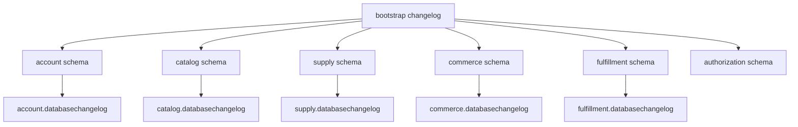

# Schema ownership

| Schema | Runtime role | Migrator role | Owner service |
| --- | --- | --- | --- |
| `account` | `fresveg_account` | `fresveg_account_migrator` | Account |
| `catalog` | `fresveg_catalog` | `fresveg_catalog_migrator` | Catalog |
| `supply` | `fresveg_supply` | `fresveg_supply_migrator` | Supply |
| `commerce` | `fresveg_commerce` | `fresveg_commerce_migrator` | Commerce |
| `fulfillment` | `fresveg_fulfillment` | `fresveg_fulfillment_migrator` | Fulfillment |
| `authorization` | `fresveg_authorization` | `fresveg_authorization` (Keycloak-managed) | Authorization server |

The root bootstrap history lives in `public.fresveg_bootstrap_changelog`. Service histories are separate and are updated only by the owning service migrator.

Keycloak uses the same PostgreSQL database as the domain services, with its own
`authorization` schema and login. Bootstrap creates the schema and role; Keycloak
creates and upgrades its own tables and migration history on startup. Its role
owns this schema because Keycloak runs its migrations using its configured database
credentials. No domain-service access to this schema is granted.

The forward migration renames `authorization_server` to `authorization`, preserving
all existing objects. Quote `"authorization"` in SQL because it is a PostgreSQL
keyword. Keycloak selects it through JDBC `currentSchema=authorization` and the
role's search path; an explicit `KC_DB_SCHEMA` would cause unquoted Hibernate SQL.
