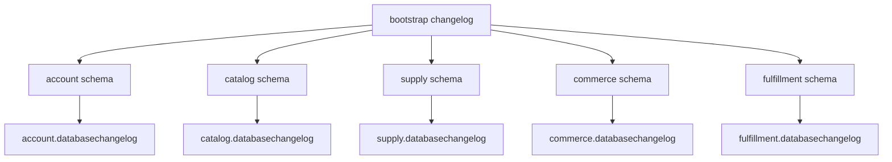

# Schema ownership

| Schema | Runtime role | Migrator role | Owner service |
| --- | --- | --- | --- |
| `account` | `fresveg_account` | `fresveg_account_migrator` | Account |
| `catalog` | `fresveg_catalog` | `fresveg_catalog_migrator` | Catalog |
| `supply` | `fresveg_supply` | `fresveg_supply_migrator` | Supply |
| `commerce` | `fresveg_commerce` | `fresveg_commerce_migrator` | Commerce |
| `fulfillment` | `fresveg_fulfillment` | `fresveg_fulfillment_migrator` | Fulfillment |

The root bootstrap history lives in `public.fresveg_bootstrap_changelog`. Service histories are separate and are updated only by the owning service migrator.
